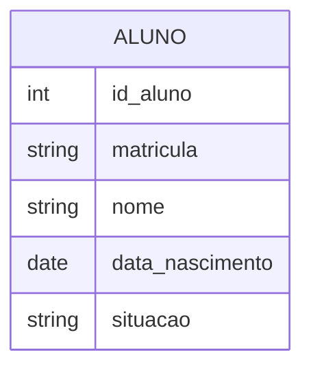
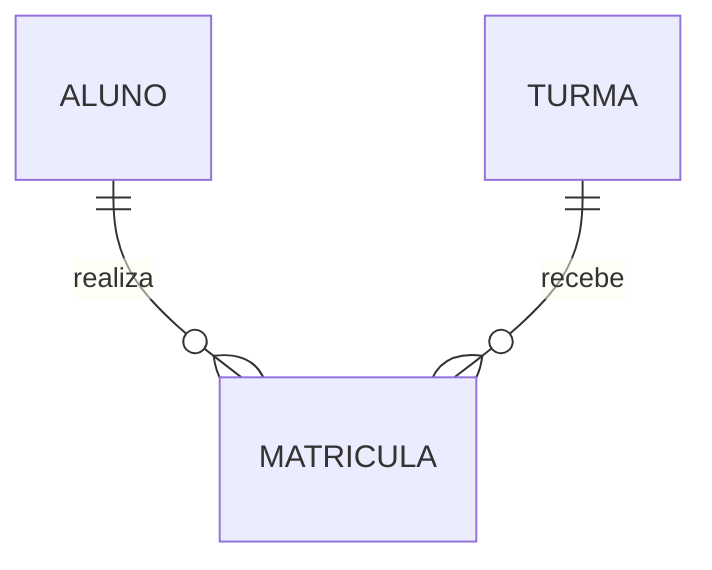
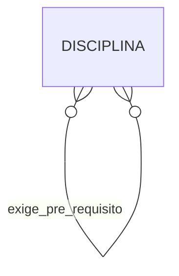
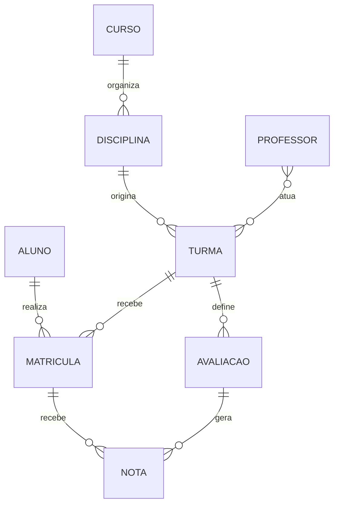

# Módulo 3 — Modelo Entidade-Relacionamento e cardinalidades

## Dados da unidade

- Duração sugerida: 4 horas
- Pré-requisitos: Módulos 1 e 2
- Produto principal: primeiro Modelo Entidade-Relacionamento do Sistema de Gestão Escolar
- Ferramentas: Markdown com Mermaid e, opcionalmente, MySQL Workbench
- Nível: modelo conceitual, ainda independente de tabelas e tipos físicos

## 1. Objetivos de aprendizagem

Ao concluir esta unidade, o estudante deverá ser capaz de:

- explicar a finalidade do Modelo Entidade-Relacionamento;
- representar entidades, atributos e identificadores;
- reconhecer e nomear relacionamentos;
- determinar cardinalidades mínima e máxima;
- diferenciar participação obrigatória e opcional;
- analisar relacionamentos 1:1, 1:N e N:N;
- reconhecer relacionamentos recursivos, ternários e associativos;
- justificar decisões de modelagem com regras de negócio;
- elaborar e revisar um diagrama conceitual;
- separar o modelo conceitual do modelo lógico e da implementação SQL.

## 2. Do catálogo ao diagrama

O Módulo 2 produziu um catálogo preliminar de entidades. O diagrama não substitui esse catálogo: ele sintetiza visualmente objetos, identificadores e vínculos.

Fluxo de trabalho:

```text
requisitos -> catálogo -> regras validadas -> modelo ER -> modelo lógico -> SQL
```

Pular a validação das regras produz cardinalidades arbitrárias.

## 3. Modelo Entidade-Relacionamento

O Modelo Entidade-Relacionamento, ou MER, descreve conceitualmente:

- quais entidades fazem parte do domínio;
- quais atributos são relevantes;
- como as entidades se relacionam;
- quantas ocorrências podem participar;
- se a participação é obrigatória ou opcional.

O Diagrama Entidade-Relacionamento, ou DER, é a representação gráfica do modelo.

Neste curso:

- MER: conteúdo conceitual;
- DER: desenho que representa esse conteúdo.

## 4. Entidades e atributos no DER

Cada entidade deve possuir:

- nome singular;
- definição conhecida;
- identificador conceitual;
- atributos relevantes;
- regras ligadas ao domínio.

Exemplo simplificado:



O tipo exibido no Mermaid é apenas ilustrativo nesta etapa. A escolha física de tipos será feita posteriormente.

## 5. Relacionamento

Relacionamento representa uma associação significativa entre entidades.

Exemplos:

- Curso contém Disciplina;
- Disciplina é ofertada em Turma;
- Aluno realiza Matrícula;
- Turma recebe Matrícula;
- Professor atua em Turma.

Um bom nome de relacionamento usa verbo e permite leitura nos dois sentidos.

Exemplo:

> Curso contém Disciplina; Disciplina pertence a Curso.

Evite nomes vagos como “tem relação” ou “possui vínculo”.

## 6. Cardinalidade máxima

A cardinalidade máxima indica quantas ocorrências podem participar.

### 6.1 Um para um — 1:1

Uma ocorrência de A relaciona-se com, no máximo, uma ocorrência de B e vice-versa.

Exemplo hipotético:

> Uma turma possui no máximo um diário oficial, e um diário pertence a uma turma.

Relacionamentos 1:1 devem ser questionados: talvez os conceitos sejam uma única entidade ou a separação exista por segurança, ciclo de vida ou opcionalidade.

### 6.2 Um para muitos — 1:N

Uma ocorrência de A pode relacionar-se com várias ocorrências de B, enquanto cada B se relaciona com uma ocorrência de A.

Exemplo preliminar:

> Uma disciplina pode originar várias turmas; cada turma corresponde a uma disciplina.

A regra depende do conceito de Turma adotado.

### 6.3 Muitos para muitos — N:N

Várias ocorrências de A podem se relacionar com várias ocorrências de B.

Exemplo:

> Um aluno participa de várias turmas, e uma turma possui vários alunos.

No domínio, esse vínculo é representado por Matrícula, que possui atributos e regras próprios.

## 7. Cardinalidade mínima e participação

A cardinalidade mínima responde se a participação é opcional ou obrigatória.

- zero: participação opcional;
- um: participação obrigatória.

Exemplos que precisam de validação:

- um curso pode existir antes de receber disciplinas: mínimo zero;
- uma turma deve estar vinculada a uma disciplina: mínimo um;
- um aluno recém-cadastrado pode não possuir matrícula: mínimo zero;
- uma matrícula deve possuir exatamente um aluno: mínimo um.

Notação textual:

| Notação | Significado |
|---|---|
| (0,1) | zero ou uma ocorrência |
| (1,1) | exatamente uma |
| (0,N) | zero ou muitas |
| (1,N) | uma ou muitas |

## 8. Como descobrir cardinalidades

Para cada relacionamento, faça quatro perguntas.

Exemplo Aluno–Matrícula:

1. Para um Aluno, qual é o mínimo de Matrículas?
2. Para um Aluno, qual é o máximo de Matrículas?
3. Para uma Matrícula, qual é o mínimo de Alunos?
4. Para uma Matrícula, qual é o máximo de Alunos?

Resposta preliminar:

- Aluno: zero a muitas Matrículas;
- Matrícula: exatamente um Aluno.

Não determine cardinalidade observando apenas os dados atuais. Uma planilha com um único professor por turma não prova que a regra máxima seja um.

## 9. Entidade associativa

Matrícula resolve conceitualmente o relacionamento N:N entre Aluno e Turma.



Leitura:

- um Aluno pode realizar zero ou muitas Matrículas;
- cada Matrícula pertence a exatamente um Aluno;
- uma Turma pode receber zero ou muitas Matrículas;
- cada Matrícula pertence a exatamente uma Turma.

Matrícula pode possuir data, situação e forma de ingresso. Portanto, não é apenas uma linha técnica de junção.

## 10. Relacionamento recursivo

Ocorre quando uma entidade se relaciona com ela própria, assumindo papéis diferentes.

Exemplo hipotético:

> Uma disciplina pode exigir outra disciplina como pré-requisito.



Os papéis devem ser claros: disciplina dependente e disciplina pré-requisito.

## 11. Relacionamento ternário

Envolve três entidades simultaneamente quando o fato não pode ser decomposto sem perda de significado.

Exemplo para análise:

> Um Professor ministra uma Disciplina em uma Turma.

Antes de criar relacionamento ternário, verifique o conceito de Turma. Se Turma já representa a oferta de uma Disciplina, Professor–Turma pode ser suficiente. Modelos devem evitar duplicar o mesmo fato.

## 12. Atributo do relacionamento

Quando uma característica descreve o vínculo, e não uma das entidades isoladamente, ela pertence ao relacionamento ou à entidade associativa.

Exemplos:

- data_matricula descreve a ligação Aluno–Turma;
- situação_matricula não descreve isoladamente Aluno nem Turma;
- data_alocacao pode descrever Professor–Turma.

Pergunta de teste:

> O valor ainda teria sentido se uma das ocorrências relacionadas fosse retirada?

## 13. Primeiro modelo conceitual do sistema escolar

Modelo de referência inicial:



Este diagrama é uma hipótese didática, não uma verdade definitiva. Entre outras questões:

- Disciplina pertence a somente um Curso ou pode ser compartilhada?
- Turma deve possuir pelo menos um Professor?
- Uma Avaliação pode existir sem notas?
- Nota é entidade associativa entre Matrícula e Avaliação?
- Frequência será vinculada a uma aula, data ou encontro?
- Curso deve possuir versões de matriz curricular?

## 14. Comparação entre níveis de modelagem

| Nível | Pergunta | Exemplos de elementos |
|---|---|---|
| Conceitual | o que existe e como se relaciona? | Aluno, Turma, Matrícula, cardinalidades |
| Lógico | como representar no modelo relacional? | relações, PK, FK, tabelas associativas |
| Físico | como implementar no SGBD escolhido? | tipos MySQL, índices, AUTO_INCREMENT |

No Módulo 3, não é necessário decidir `VARCHAR(150)`, `ENGINE=InnoDB` ou nomes de constraints.

## 15. Prática guiada

### Etapa 1 — Preparar a branch

Após a incorporação do material:

```bash
git switch main
git pull origin main
git switch -c atividade/modulo-03-seu-nome
```

### Etapa 2 — Revisar o catálogo

Confira, para cada entidade:

- definição;
- identificador;
- atributos;
- regras;
- relacionamentos percebidos;
- dúvidas abertas.

### Etapa 3 — Preencher a matriz de cardinalidades

Use:

- [Matriz de relacionamentos e cardinalidades](matriz-cardinalidades.md)

Não desenhe antes de justificar cada vínculo.

### Etapa 4 — Criar o DER em Mermaid

Crie:

```text
sistema-gestao-escolar/docs/diagramas/der-conceitual-seu-nome.md
```

Estrutura mínima:

```markdown
# DER conceitual

## Regras adotadas

## Diagrama


## Dúvidas pendentes
```

### Etapa 5 — Conferir o diagrama

Para cada linha, leia em ambos os sentidos. Exemplo:

- Aluno pode realizar zero ou muitas Matrículas.
- Matrícula deve pertencer a exatamente um Aluno.

Se a leitura não corresponde à regra, corrija a notação ou a regra.

### Etapa 6 — Versionar

```bash
git status
git diff
git add sistema-gestao-escolar/docs/diagramas/
git add sistema-gestao-escolar/atividades/modulo-03/
git commit -m "docs: modela relacionamentos e cardinalidades"
git push -u origin atividade/modulo-03-seu-nome
```

## 16. Exercício individual

- [Atividade 03 — Modelo conceitual](../../../atividades/modulo-03/atividade-03-modelo-conceitual.md)

## 17. Desafio

Avalie criticamente:

1. Curso–Disciplina deve ser 1:N ou N:N?
2. Professor–Turma exige entidade associativa?
3. Frequência deve se relacionar diretamente a Turma ou Matrícula?
4. Nota pode ser atributo de Matrícula?
5. Como modelar uma disciplina que exige vários pré-requisitos?
6. O que muda se um aluno puder refazer a mesma turma?

Não existe resposta única sem regras adicionais. A qualidade está na justificativa e nas perguntas de validação.

## 18. Erros frequentes

- definir cardinalidade a partir da amostra atual;
- inverter os símbolos da notação;
- omitir cardinalidade mínima;
- desenhar N:N e esquecer dados do vínculo;
- transformar relatório em entidade;
- misturar tipos físicos no modelo conceitual;
- duplicar um fato em relacionamentos diferentes;
- usar relacionamento sem verbo;
- criar relacionamento ternário desnecessário;
- omitir dúvidas e apresentar hipótese como regra validada.

## 19. Checklist

- [ ] diferencio MER e DER;
- [ ] nomeio entidades no singular;
- [ ] nomeio relacionamentos com verbos;
- [ ] determino cardinalidades mínima e máxima;
- [ ] leio cada relacionamento nos dois sentidos;
- [ ] reconheço participação opcional e obrigatória;
- [ ] resolvo conceitualmente N:N com entidade associativa quando necessário;
- [ ] reconheço relacionamento recursivo;
- [ ] separo modelo conceitual de lógico e físico;
- [ ] documento regras e dúvidas;
- [ ] renderizo o Mermaid sem erro;
- [ ] versiono a entrega.

## 20. Critérios de avaliação

| Critério | Peso |
|---|---:|
| Entidades e definições | 15% |
| Relacionamentos significativos | 20% |
| Cardinalidades máximas | 15% |
| Cardinalidades mínimas | 15% |
| Entidades associativas | 10% |
| Justificativas e regras | 15% |
| Legibilidade, Mermaid e Git | 10% |

## 21. Referências

- CHEN, Peter P. The Entity-Relationship Model: Toward a Unified View of Data. *ACM Transactions on Database Systems*, 1976.
- RAMAKRISHNAN, R.; GEHRKE, J. *Sistemas de gerenciamento de bancos de dados*. McGraw-Hill, 2008.
- SILBERSCHATZ, A.; KORTH, H. F.; SUDARSHAN, S. *Sistema de banco de dados*. Elsevier, 2012.

## 22. Material do professor

- [Gabarito comentado do Módulo 3](../../gabaritos/modulo-03-gabarito.md)
