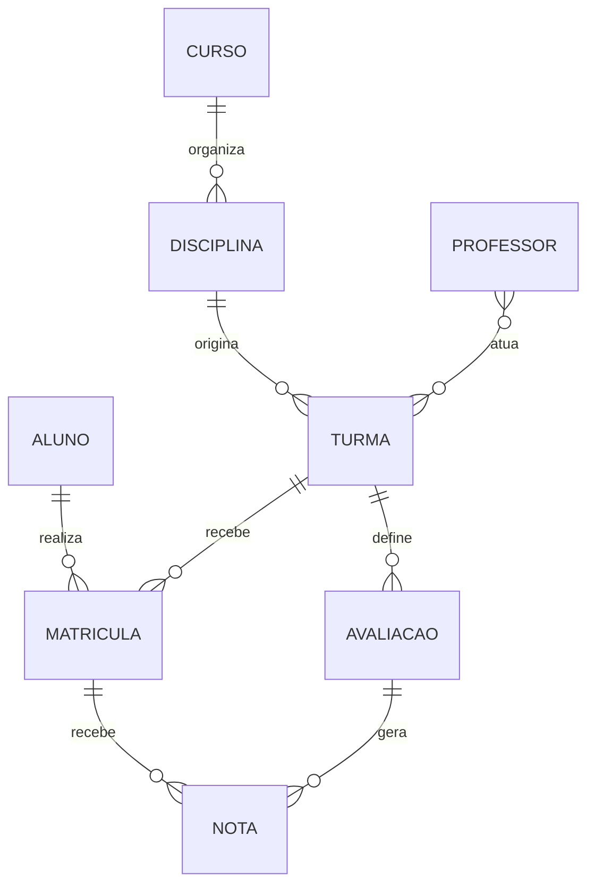

# DER conceitual de referência

> Modelo didático inicial. As cardinalidades devem ser validadas com as regras da instituição antes da conversão para o modelo lógico.

## Diagrama

## Leituras principais

- Um Aluno pode realizar zero ou muitas Matrículas; cada Matrícula pertence a exatamente um Aluno.
- Uma Turma pode receber zero ou muitas Matrículas; cada Matrícula pertence a exatamente uma Turma.
- Uma Disciplina pode originar zero ou muitas Turmas; cada Turma corresponde a exatamente uma Disciplina.
- Professor–Turma foi tratado preliminarmente como N:N.
- Nota representa o resultado de uma Matrícula em uma Avaliação.

## Hipóteses que exigem validação

1. Cada Disciplina pertence a somente um Curso.
2. Uma Turma pode existir sem Professor durante o planejamento.
3. Uma Turma pode possuir mais de um Professor.
4. Avaliação pertence a uma única Turma.
5. Uma Matrícula pode receber no máximo uma Nota por Avaliação.
6. O aluno pode ou não refazer a mesma Turma.
7. Frequência será detalhada após definir Aula/Encontro.

## Limites

Este artefato não define:

- tabelas;
- chaves estrangeiras;
- tipos MySQL;
- índices;
- nomes de constraints;
- políticas definitivas de exclusão.

Esses elementos pertencem aos modelos lógico e físico.
