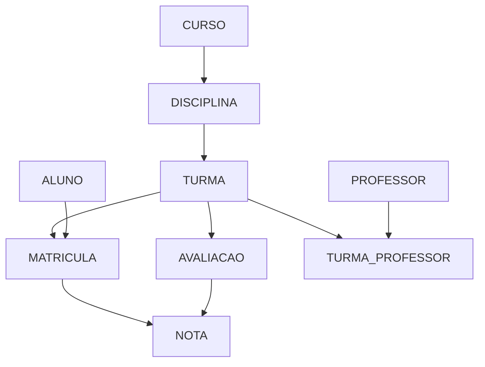

# Esquema lógico relacional de referência

> Versão didática derivada do DER do Módulo 3. Não contém tipos físicos do MySQL.

## Notação

- `PK`: chave primária;
- `FK`: chave estrangeira;
- `UQ`: restrição de unicidade;
- seta: relação e chave referenciadas.

## Relações

```text
ALUNO(
  id_aluno PK,
  matricula UQ,
  nome,
  nome_social,
  data_nascimento,
  email,
  situacao
)

PROFESSOR(
  id_professor PK,
  codigo_funcional UQ,
  nome,
  email_institucional UQ,
  situacao
)

CURSO(
  id_curso PK,
  codigo UQ,
  nome,
  carga_horaria,
  situacao
)

DISCIPLINA(
  id_disciplina PK,
  id_curso FK -> CURSO.id_curso,
  codigo,
  nome,
  carga_horaria,
  situacao,
  UQ(id_curso, codigo)
)

TURMA(
  id_turma PK,
  id_disciplina FK -> DISCIPLINA.id_disciplina,
  codigo,
  periodo,
  data_inicio,
  data_fim,
  capacidade,
  situacao,
  UQ(id_disciplina, codigo, periodo)
)

TURMA_PROFESSOR(
  id_turma PK, FK -> TURMA.id_turma,
  id_professor PK, FK -> PROFESSOR.id_professor,
  data_inicio,
  data_fim,
  papel
)

MATRICULA(
  id_matricula PK,
  id_aluno FK -> ALUNO.id_aluno,
  id_turma FK -> TURMA.id_turma,
  data_matricula,
  situacao,
  forma_ingresso
)

AVALIACAO(
  id_avaliacao PK,
  id_turma FK -> TURMA.id_turma,
  titulo,
  data_avaliacao,
  valor_maximo,
  peso
)

NOTA(
  id_nota PK,
  id_matricula FK -> MATRICULA.id_matricula,
  id_avaliacao FK -> AVALIACAO.id_avaliacao,
  valor,
  data_lancamento,
  UQ(id_matricula, id_avaliacao)
)
```

## Dependências referenciais



As setas representam dependência por FK, não fluxo de dados.

## Restrições pendentes

### Matrícula

A unicidade depende da regra institucional:

- uma matrícula por aluno/turma em todo o histórico;
- uma matrícula ativa por aluno/turma;
- múltiplas tentativas identificadas por período ou número.

### Curso e disciplina

O esquema assume Disciplina pertencente a um Curso. Se for compartilhada, será necessária relação associativa, possivelmente ligada à matriz curricular.

### Professor e turma

A relação associativa permite vários professores e histórico de alocação.

### Nota

A unicidade `matrícula + avaliação` assume uma nota vigente por avaliação. Versões e retificações exigem outra modelagem.

### Frequência

Ainda não incluída porque falta definir Aula/Encontro e a unidade de registro.

## Limites

Este esquema não define:

- `VARCHAR`, `DECIMAL` ou outros tipos físicos;
- `AUTO_INCREMENT`;
- índices físicos;
- ações `ON DELETE`;
- nomes finais de constraints;
- engine ou charset;
- migrations do ORM.
