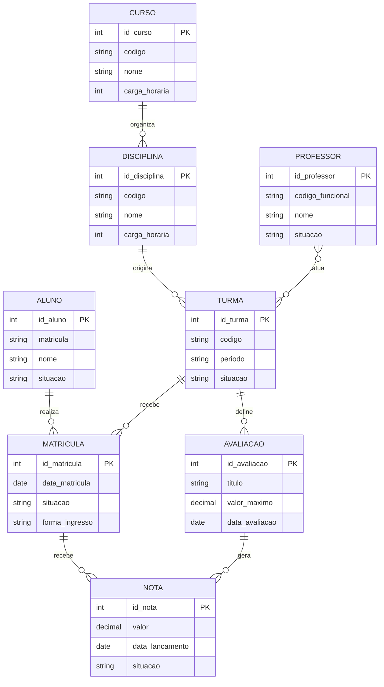

# Gabarito comentado — Módulo 3

> O modelo apresentado é uma referência didática. Cardinalidades dependem das regras da instituição. Aceite alternativas coerentes quando as hipóteses forem explícitas e justificadas.

## Parte A — Conceitos

1. MER é o conteúdo conceitual; DER é sua representação gráfica.
2. O modelo conceitual descreve o domínio e deve permanecer independente do SGBD.
3. Cardinalidade mínima expressa obrigatoriedade; máxima expressa limite de ocorrências.
4. Participação opcional significa mínimo zero.
5. N:N tende a exigir entidade associativa quando o vínculo precisa ser identificado, receber atributos ou regras.
6. Relacionamento recursivo ocorre entre ocorrências da mesma entidade em papéis distintos.
7. Dados atuais mostram uma instância, não todos os estados permitidos pela regra.

## Parte B — Matriz de referência

| Relacionamento | Lado A | Lado B | Hipótese didática |
|---|---|---|---|
| Curso–Disciplina | Curso 0..N | Disciplina 1..1 | cada disciplina pertence a um curso |
| Disciplina–Turma | Disciplina 0..N | Turma 1..1 | turma oferta uma disciplina |
| Professor–Turma | Professor 0..N | Turma 0..N | pode haver docência compartilhada |
| Aluno–Matrícula | Aluno 0..N | Matrícula 1..1 | aluno pode existir sem matrícula |
| Turma–Matrícula | Turma 0..N | Matrícula 1..1 | matrícula pertence a uma turma |
| Turma–Avaliação | Turma 0..N | Avaliação 1..1 | avaliação pertence a turma |
| Matrícula–Nota | Matrícula 0..N | Nota 1..1 | matrícula recebe várias notas |
| Avaliação–Nota | Avaliação 0..N | Nota 1..1 | cada nota pertence a avaliação |

Pontos obrigatórios de discussão:

- Curso–Disciplina pode ser N:N se disciplinas forem compartilhadas.
- Turma pode exigir professor antes de ficar ativa, alterando mínimo.
- Avaliação pode exigir ao menos uma nota apenas após determinada etapa.
- rematrícula na mesma turma afeta identidade e unicidade de Matrícula.

## Parte C — DER de referência

Os tipos são ilustrativos. Não avaliar como projeto físico.

## Parte D — Leituras esperadas

Exemplos:

- Um Aluno pode realizar zero ou muitas Matrículas; cada Matrícula pertence a exatamente um Aluno.
- Uma Turma pode receber zero ou muitas Matrículas; cada Matrícula pertence a exatamente uma Turma.
- Uma Turma pode definir zero ou muitas Avaliações; cada Avaliação pertence a exatamente uma Turma.
- Uma Avaliação pode gerar zero ou muitas Notas; cada Nota corresponde a exatamente uma Avaliação.
- Um Professor pode atuar em zero ou muitas Turmas; uma Turma pode possuir zero ou muitos Professores na hipótese inicial.

## Parte E — Análise crítica

### Curso–Disciplina

Não é necessariamente 1:N. Se uma disciplina padronizada puder integrar vários cursos, será N:N, possivelmente com dados específicos por matriz.

### Professor–Turma

Pode ser N:N. O vínculo pode guardar papel, data de início, data de fim e carga atribuída. Isso favorece entidade associativa.

### Nota

Nota depende de Matrícula e Avaliação. Tratá-la apenas como atributo de Matrícula impede várias avaliações e perde o contexto.

### Pré-requisito

Relacionamento recursivo N:N de Disciplina, com papéis “dependente” e “pré-requisito”. Pode haver atributos como tipo ou nota mínima.

### Refazer turma

Aluno + Turma deixa de ser suficiente se uma nova matrícula histórica for permitida. Pode ser necessário período/tentativa ou identificador substituto e regra de unicidade temporal.

### Frequência

A resposta depende da unidade de registro. Em geral, presença pertence à matrícula e a uma aula/encontro. Apenas data pode ser insuficiente se houver várias aulas no mesmo dia.

## Parte F — Erros

1. 1:1 contradiz o histórico de várias matrículas.
2. Verbo genérico não esclarece semântica nem regra.
3. Tela é elemento da solução, não entidade do domínio.
4. Idade muda e pode ser derivada de data de nascimento.
5. Amostra não define o máximo permitido.
6. Tipos e recursos MySQL pertencem ao modelo físico.

## Rubrica de correção

| Nível | Evidência |
|---|---|
| Excelente | cardinalidades justificadas, leituras consistentes, hipóteses explícitas e DER legível |
| Satisfatório | modelo coerente com pequenas imprecisões de notação |
| Insuficiente | cardinalidades arbitrárias, mistura de níveis ou relacionamentos sem significado |

## Sinais de atenção

- ausência de mínimo;
- notação invertida;
- N:N sem análise do vínculo;
- tipos MySQL tratados como decisão conceitual;
- diagrama sem regras textuais;
- hipótese apresentada como fato;
- entidade criada apenas por existir uma tela ou relatório.
